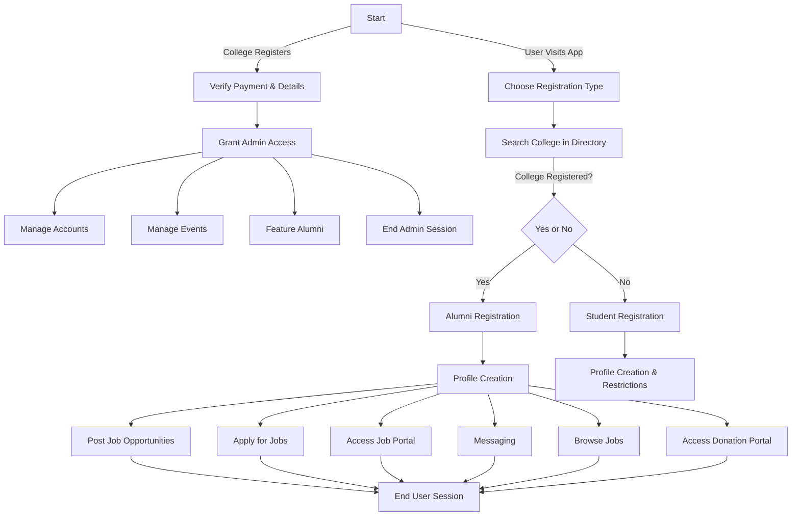

# 🎓 LinkLum – College Alumni Registration & Admin Management System

Welcome to the **LinkLum**, a web platform designed to connect alumni with their college, fostering a vibrant and engaged alumni network. This portal allows alumni to register their profiles, stay updated on events, and engage with their alma mater. The admin dashboard enables administrators to easily manage alumni profiles and promote upcoming events.

## 📌 About Me  
I am **Anish Kumar Singh**, a **Full-Stack Developer** and **Team Leader** of LinkLum, developed during the **Smart India Hackathon**, where our team secured **🏆 1st Place**. As the **Team Leader**, I was responsible for:  
- Architecting the **scalable system design** and development strategy  
- Leading a **cross-functional team** of developers, designers, and strategists  
- Implementing **high-performance features** googleLightHouse.jpg 
- Ensuring **100/100 Google Lighthouse scores** for **Performance, SEO, Accessibility & Best Practices**  

- Successfully handling **100,000+ concurrent users** through K6 load testing  

## 🚀 Key Features

- **📝 Alumni Registration**: Alumni can register their profiles, including personal and professional details, to stay connected with their college.
- **🛠️ Admin Dashboard**: Admins have full control to approve, update, and manage alumni profiles, ensuring accurate and up-to-date information.
- **📅 Event Management**: Admins can create and manage upcoming alumni events, ensuring greater participation from the community.
- **🌟 Featured Alumni**: Highlight distinguished alumni by displaying their image, name, and current role, providing inspiration and connection to others.

## 🛠️ Tech Stack

- **Frontend**: [Next.js](https://nextjs.org/), [Tailwind CSS](https://tailwindcss.com/)
- **Backend**: [Node.js](https://nodejs.org/), [Express.js](https://expressjs.com/)
- **Database**: [MongoDB](https://www.mongodb.com/)
- **Payment Integration**: [Stripe](https://stripe.com/)
- **Real-Time Communication**: [Socket.io](https://socket.io/)
- **Image Hosting**: [Cloudinary](https://cloudinary.com/)
- **Containerization**: [Docker](https://www.docker.com/)
- **Animations**: [GSAP (GreenSock Animation Platform)](https://greensock.com/gsap/)

# College Alumni & Student Registration Portal - User Flow Schema

## Overview

This project outlines the user flow schema for a **College Alumni and Student Registration Portal**. It is designed to provide a clear understanding of the registration process and the interactions between users (alumni, students, and administrators) within the platform.

### Features:

- **Alumni Registration**: Allows alumni to create profiles, manage events, feature prominent alumni, and access job and donation portals.
- **Student Registration**: Students can create profiles with restrictions, apply for jobs, and access a job portal.
- **Admin Access**: Admins manage accounts, events, and alumni features.
- **User Sessions**: Both alumni and student users can browse job opportunities, apply for jobs, and access messaging functionalities.

## Project Preview

[View on Eraser ](https://app.eraser.io/workspace/nUk7TGsdzzudksvIKjeZ?elements=iqTZG7Ls-pERnVCsI1O5mA)

## Flowchart Description

1. **Start**: Users begin by visiting the app.
2. **Choose Registration Type**: Users select whether they are registering as an Alumni or a Student.
   - If the college is not registered, it must register first.
3. **Alumni and Student Flows**: 
   - Alumni can access additional features such as managing events, posting job opportunities, and accessing the donation portal.
   - Students have profile restrictions but can access job listings and messaging functionalities.
4. **Admin Section**: Admins manage alumni profiles, accounts, and events.
5. **End Sessions**: Users and admins can end their sessions after completing tasks.

## Technology

The schema is created using **Eraser.io**, a visual collaboration and diagramming tool that helps map out processes and workflows efficiently.

## 📊 System Design  

## Learn More

To learn more about Next.js, take a look at the following resources:

- [Next.js Documentation](https://nextjs.org/docs) - learn about Next.js features and API.
- [Learn Next.js](https://nextjs.org/learn) - an interactive Next.js tutorial.

You can check out [the Next.js GitHub repository](https://github.com/vercel/next.js/) - your feedback and contributions are welcome!

## Deploy on Vercel

The easiest way to deploy your Next.js app is to use the [Vercel Platform](https://vercel.com/new?utm_medium=default-template&filter=next.js&utm_source=create-next-app&utm_campaign=create-next-app-readme) from the creators of Next.js.

Check out our [Next.js deployment documentation](https://nextjs.org/docs/deployment) for more details.
