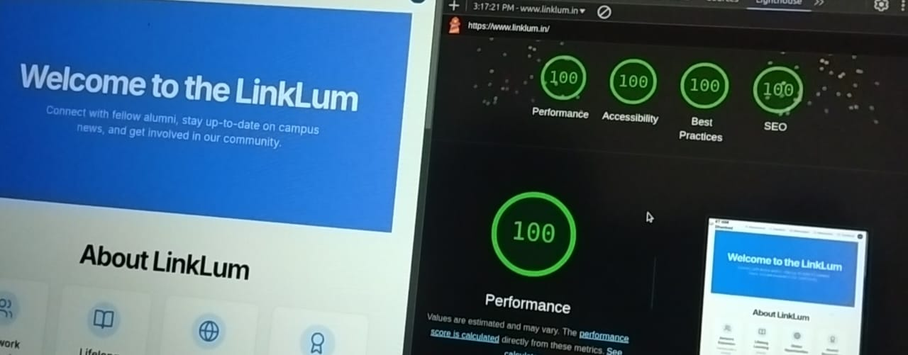
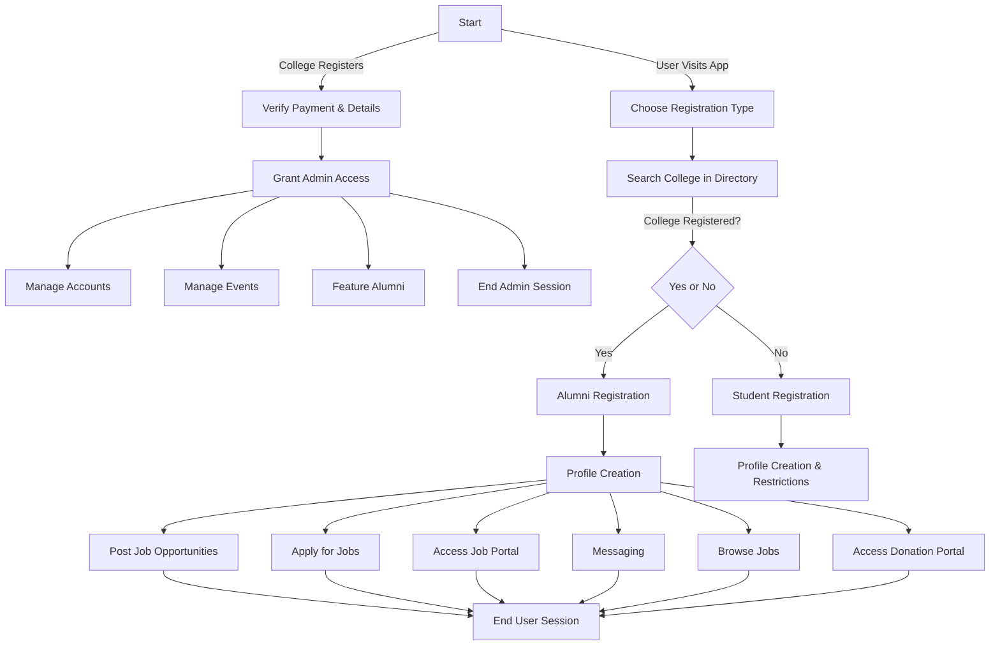

# 🎓 LinkLum – College Alumni Registration & Admin Management System

Welcome to the **LinkLum**, a web platform designed to connect alumni with their college, fostering a vibrant and engaged alumni network. This portal allows alumni to register their profiles, stay updated on events, and engage with their alma mater. The admin dashboard enables administrators to easily manage alumni profiles and promote upcoming events.

## 📌 About Me  
I am **Anish Kumar Singh**, a **Full-Stack Developer** and **Team Leader** of LinkLum, developed during the **Internal Smart India Hackathon**, where our team secured **🏆 1st Place**. As the **Team Leader**, I was responsible for:  
- Architecting the **scalable system design** and development strategy  
- Leading a **cross-functional team** of developers, designers, and strategists  
- Implementing **high-performance features** 
- Ensuring **100/100 Google Lighthouse scores** for **Performance, SEO, Accessibility & Best Practices**  

- Successfully handling **100,000+ concurrent users** through K6 load testing  

## 🚀 Key Features  

### 🎓 Alumni & Student Features  
- 📝 **Alumni and Student Registration**: Alumni and Student can register and maintain an up-to-date profile.  
- 📂 **Profile & Portfolio Management**: Users can showcase their resumes, skills, and achievements.  
- 💼 **Job Portal**: Alumni can post job openings, and students can apply for them.  
- 💬 **Networking & Messaging**: Direct messaging system for alumni and students to connect.  
- 🎤 **Mentorship Program**: Alumni can sign up as mentors and provide career guidance.  
- 🔍 **Smart College Directory**: Users can search for and register under their respective colleges.  

### 🏫 College & Admin Management  
- 🏛 **College Registration & Verification**: Institutions can register, verify details, and gain admin access.  
- 👨‍💻 **Admin Dashboard**: Controls user profiles, events, and alumni engagement.  
- 🌟 **Featured Alumni Section**: Highlight accomplished alumni with their success stories.  
- 📅 **Event Management**: Admins can organize, promote, and manage alumni events.  
- 💰 **Donation Portal**: Alumni can contribute financially to their college through a dedicated system.  

### 🔍 Advanced Search & Analytics  
- 📊 **User Engagement Analytics**: Track job applications, event participation, and alumni interactions.  
- 🔎 **Advanced Search & Filters**: Find alumni, jobs, events, or mentors based on criteria like skills, batch year, or location.  

### 🔐 Security & Authentication  
- 🔑 **Secure Authentication**: JWT-based authentication with OAuth login options.  
- 🛡️ **Role-Based Access Control**: Distinct permissions for students, alumni, and admins.  

## 🛠️ Tech Stack  

### 🎨 Frontend  
- 🚀 **[Next.js](https://nextjs.org/)** – React framework for fast, SEO-friendly applications.  
- 🎨 **[Tailwind CSS](https://tailwindcss.com/)** – Utility-first CSS framework for responsive design.  
- 🎭 **[Framer Motion](https://www.framer.com/motion/)** – Advanced animations and smooth UI transitions.  

### 🖥️ Backend  
- ⚡ **[Node.js](https://nodejs.org/)** – Scalable JavaScript runtime for backend development.  
- 🔧 **[Express.js](https://expressjs.com/)** – Minimal and flexible Node.js framework.  

### 🗄️ Database & Caching  
- 🛢️ **[MongoDB](https://www.mongodb.com/)** – NoSQL database for efficient data storage and retrieval.  
- ⚡ **[Redis](https://redis.io/)** – In-memory caching to improve performance.  

### 💳 Payment Integration  
- 💰 **[Stripe](https://stripe.com/)** – Secure and seamless online payment processing.  

### 🔄 Real-Time Communication  
- 📡 **[Socket.io](https://socket.io/)** – Enables real-time, bidirectional event-based communication.  

### 🖼️ Image & Media Hosting  
- ☁️ **[Cloudinary](https://cloudinary.com/)** – Cloud-based image and video management service.  

### 📊 Performance & Testing  
- 🏎 **[K6](https://k6.io/)** – Load testing for high-performance applications.  

### 🏗️ Deployment & Hosting  
- 🐳 **[Docker](https://www.docker.com/)** – Containerization for easy deployment and scaling.  
- ☁️ **[Vercel](https://vercel.com/)** – Fast and scalable hosting for frontend applications.  
## High-Level System Architecture
+-------------------------------+
|        Frontend (Next.js)      |
|  - User Dashboard             |
|  - Profile Management         |
|  - Job & Event Listings       |
|  - Messaging                  |
+-------------------------------+
                |
                v
+-------------------------------+
|     API Gateway (Express.js)  |
|  - Routes Requests            |
|  - Auth Middleware (JWT)      |
+-------------------------------+
                |
                v
+---------------------------------------------------+
|                Microservices Layer                |
|---------------------------------------------------|
|  🟢 User Layer                                   |
|  - User, Alumni, Job, Mentorship Services        |
|---------------------------------------------------|
|  🔵 College Layer                                |
|  - College, Event, Donation Services             |
|---------------------------------------------------|
|  🟠 Chat Layer                                   |
|  - Chat, Notifications, Search & Analytics      |
+---------------------------------------------------+
                |
                v
+---------------------------------------------+
|        Database Layer (MongoDB + Redis)     |
|  - User Profiles & Jobs                     |
|  - Events & Donations                       |
|  - Redis for Caching                        |
+---------------------------------------------+
                |
                v
+-----------------------------+
|    External Integrations    |
| - Cloudinary (Images)       |
| - Stripe (Payments)         |
| - Vercel (Hosting)          |
| - K6 (Load Testing)         |
+-----------------------------+

# College Alumni & Student Registration Portal - User Flow Schema

## Overview

This project outlines the user flow schema for a **College Alumni and Student Registration Portal**. It is designed to provide a clear understanding of the registration process and the interactions between users (alumni, students, and administrators) within the platform.

### Features:

- **Alumni Registration**: Allows alumni to create profiles, manage events, feature prominent alumni, and access job and donation portals.
- **Student Registration**: Students can create profiles with restrictions, apply for jobs, and access a job portal.
- **Admin Access**: Admins manage accounts, events, and alumni features.
- **User Sessions**: Both alumni and student users can browse job opportunities, apply for jobs, and access messaging functionalities.

## Project Preview

[View on Eraser ](https://app.eraser.io/workspace/nUk7TGsdzzudksvIKjeZ?elements=iqTZG7Ls-pERnVCsI1O5mA)

## Flowchart Description

1. **Start**: Users begin by visiting the app.
2. **Choose Registration Type**: Users select whether they are registering as an Alumni or a Student.
   - If the college is not registered, it must register first.
3. **Alumni and Student Flows**: 
   - Alumni can access additional features such as managing events, posting job opportunities, and accessing the donation portal.
   - Students have profile restrictions but can access job listings and messaging functionalities.
4. **Admin Section**: Admins manage alumni profiles, accounts, and events.
5. **End Sessions**: Users and admins can end their sessions after completing tasks.

## Technology

The schema is created using **Eraser.io**, a visual collaboration and diagramming tool that helps map out processes and workflows efficiently.

## 📊 System Design  

## Learn More

To learn more about Next.js, take a look at the following resources:

- [Next.js Documentation](https://nextjs.org/docs) - learn about Next.js features and API.
- [Learn Next.js](https://nextjs.org/learn) - an interactive Next.js tutorial.

You can check out [the Next.js GitHub repository](https://github.com/vercel/next.js/) - your feedback and contributions are welcome!

## Deploy on Vercel

The easiest way to deploy your Next.js app is to use the [Vercel Platform](https://vercel.com/new?utm_medium=default-template&filter=next.js&utm_source=create-next-app&utm_campaign=create-next-app-readme) from the creators of Next.js.

Check out our [Next.js deployment documentation](https://nextjs.org/docs/deployment) for more details.
