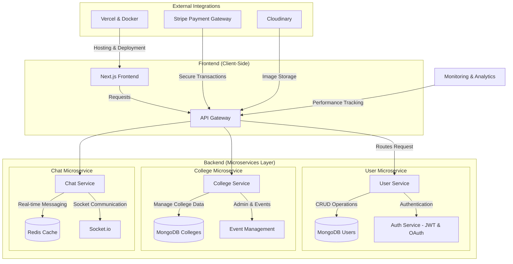

# 🎓 LinkLum – College Alumni Registration & Admin Management System

Welcome to the **LinkLum**, a web platform designed to connect alumni with their college, fostering a vibrant and engaged alumni network. This portal allows alumni to register their profiles, stay updated on events, and engage with their alma mater. The admin dashboard enables administrators to easily manage alumni profiles and promote upcoming events.

- Architecting the **scalable system design** and development strategy  
- Leading a **cross-functional team** of developers, designers, and strategists  
- Implementing **high-performance features** 
- Ensuring **100/100 Google Lighthouse scores** for **Performance, SEO, Accessibility & Best Practices**  

- Successfully handling **100,000+ concurrent users** through K6 load testing  

## 🚀 Key Features  

### 🎓 Alumni & Student Features  
- 📝 **Alumni and Student Registration**: Alumni and Student can register and maintain an up-to-date profile.  
- 📂 **Profile & Portfolio Management**: Users can showcase their resumes, skills, and achievements.  
- 💼 **Job Portal**: Alumni can post job openings, and students can apply for them.  
- 💬 **Networking & Messaging**: Direct messaging system for alumni and students to connect.  
- 🎤 **Mentorship Program**: Alumni can sign up as mentors and provide career guidance.  
- 🔍 **Smart College Directory**: Users can search for and register under their respective colleges.  

### 🏫 College & Admin Management  
- 🏛 **College Registration & Verification**: Institutions can register, verify details, and gain admin access.  
- 👨‍💻 **Admin Dashboard**: Controls user profiles, events, and alumni engagement.  
- 🌟 **Featured Alumni Section**: Highlight accomplished alumni with their success stories.  
- 📅 **Event Management**: Admins can organize, promote, and manage alumni events.  
- 💰 **Donation Portal**: Alumni can contribute financially to their college through a dedicated system.  

### 🔍 Advanced Search & Analytics  
- 📊 **User Engagement Analytics**: Track job applications, event participation, and alumni interactions.  
- 🔎 **Advanced Search & Filters**: Find alumni, jobs, events, or mentors based on criteria like skills, batch year, or location.  

### 🔐 Security & Authentication  
- 🔑 **Secure Authentication**: JWT-based authentication with OAuth login options.  
- 🛡️ **Role-Based Access Control**: Distinct permissions for students, alumni, and admins.  

## 🛠️ Tech Stack  

### 🎨 Frontend  
- 🚀 **[Next.js](https://nextjs.org/)** – React framework for fast, SEO-friendly applications.  
- 🎨 **[Tailwind CSS](https://tailwindcss.com/)** – Utility-first CSS framework for responsive design.  
- 🎭 **[Framer Motion](https://www.framer.com/motion/)** – Advanced animations and smooth UI transitions.  

### 🖥️ Backend  
- ⚡ **[Node.js](https://nodejs.org/)** – Scalable JavaScript runtime for backend development.  
- 🔧 **[Express.js](https://expressjs.com/)** – Minimal and flexible Node.js framework.  

### 🗄️ Database & Caching  
- 🛢️ **[MongoDB](https://www.mongodb.com/)** – NoSQL database for efficient data storage and retrieval.  
- ⚡ **[Redis](https://redis.io/)** – In-memory caching to improve performance.  

### 💳 Payment Integration  
- 💰 **[Stripe](https://stripe.com/)** – Secure and seamless online payment processing.  

### 🔄 Real-Time Communication  
- 📡 **[Socket.io](https://socket.io/)** – Enables real-time, bidirectional event-based communication.  

### 🖼️ Image & Media Hosting  
- ☁️ **[Cloudinary](https://cloudinary.com/)** – Cloud-based image and video management service.  

### 📊 Performance & Testing  
- 🏎 **[K6](https://k6.io/)** – Load testing for high-performance applications.  

### 🏗️ Deployment & Hosting  
- 🐳 **[Docker](https://www.docker.com/)** – Containerization for easy deployment and scaling.  
- ☁️ **[Vercel](https://vercel.com/)** – Fast and scalable hosting for frontend applications.  
## High-Level System Architecture

# User Flow 

## Flowchart Description

1. **Start**: Users begin by visiting the app.
2. **Choose Registration Type**: Users select whether they are registering as an Alumni or a Student.
   - If the college is not registered, it must register first.
3. **Alumni and Student Flows**: 
   - Alumni can access additional features such as managing events, posting job opportunities, and accessing the donation portal.
   - Students have profile restrictions but can access job listings and messaging functionalities.
4. **Admin Section**: Admins manage alumni profiles, accounts, and events.
5. **End Sessions**: Users and admins can end their sessions after completing tasks.

## Project Preview

[View on Eraser ](https://app.eraser.io/workspace/nUk7TGsdzzudksvIKjeZ?elements=iqTZG7Ls-pERnVCsI1O5mA)

## Other Repo Link 
 https://github.com/linklum-in
## ppt
 https://www.canva.com/design/DAGY6EEAUA4/A0VgXf-8a7CFDZY0WzDwcg/edit?utm_content=DAGY6EEAUA4&utm_campaign=designshare&utm_medium=link2&utm_source=sharebutton
## Api Documentation
 https://documenter.getpostman.com/view/34081966/2sAYBa8omX
## Wireframe
https://www.figma.com/design/SiW6hPrlfvCk7APza0RDVQ/Untitled?node-id=0-1&m=dev&t=KcAuJBo5yOSlC6f0-1

